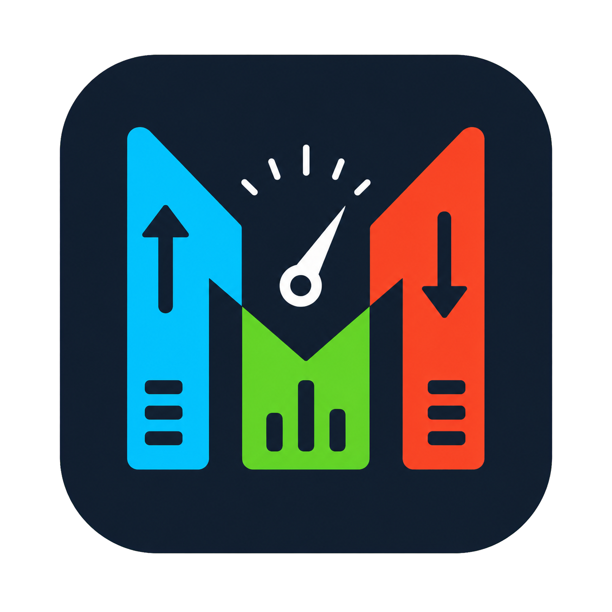

<p align="center">
  
</p>

# MacMeter

MacMeter is a native macOS menu-bar monitor for Apple Silicon. It keeps CPU usage, SoC temperature, network throughput, and battery power visible without opening Activity Monitor or occupying the Dock.

MacMeter is designed for a compact, glanceable two-line layout. Every enabled metric remains visible in Compact mode, while Cycle mode shows one metric at a time when menu-bar space is limited.

## Supported platform

- Apple Silicon Macs (M1 or newer)
- macOS 13 Ventura or newer
- Native `arm64` application
- Menu-bar-only operation (`LSUIElement`); no Dock icon

Intel Macs and macOS versions earlier than 13 are not supported.

## Features

### CPU

- Normalized utilization from 0–100%, regardless of core count
- Summed utilization up to `core count × 100%` (for example, six fully utilized cores display 600%)
- Per-core utilization in the details popover
- Runtime Performance/Efficiency core classification on Apple Silicon
- Both normalized and summed totals remain available in the popover
- Progressive green, yellow, orange, and red emphasis makes rising utilization easy to scan

### Temperature

- Hottest valid SoC temperature in Celsius or Fahrenheit
- Uses runtime-discovered `SOC MTR Temp` sensors when available
- Falls back to read-only AppleSMC CPU/GPU die sensors on supported systems
- Displays `—` instead of substituting unrelated or stale temperature data
- Progressive green, yellow, orange, and red emphasis communicates increasing thermal pressure

### Network

- Simultaneous upload and download rates
- Upload is red; download is green
- Selectable decimal-SI units: `Kbps`, `KBps`, `Mbps`, and `MBps`
- Aggregates active physical Ethernet/Wi-Fi interfaces while excluding loopback and tunnel/VPN interfaces
- Re-baselines counters after interface changes, resets, sleep, and wake

### Battery power

- Battery-terminal power calculated from signed current and voltage
- Compact `C 30W` charging and `D 8.4W` draining labels
- Charging is green, draining is red, and idle/no-flow is blue
- Full Charging/Draining descriptions are exposed to VoiceOver, so meaning does not depend on color
- A missing battery or inconsistent telemetry displays `—` without interrupting other metrics

### Display and configuration

- Enable or disable CPU, temperature, network, and battery independently
- Compact mode (default): all selected metrics stay visible in two rows whenever more than one metric is enabled. Network always owns the top row; without Network, CPU and temperature lead while battery power uses the second row. Four metrics use:

  ```text
  ↑0.0 ↓0.5MB/s
  42% | 80°C | D 12W
  ```

- Cycle mode: rotates through enabled metrics every five seconds
- Status text is vertically centered from the actual AppKit status-button geometry and display scale
- Dark rounded backdrop and high-contrast native typography
- Refresh interval choices of 1, 2, 5, or 10 seconds; default is 2 seconds
- Launch at Login through `SMAppService.mainApp`
- Native Settings window with Metrics, Appearance, General, and About sections
- Fixed-width Settings canvas keeps every card and control inside the same viewport, including longer translated copy
- Native checkboxes make enabled Visible metrics unambiguous
- System-language detection by default, with an immediate language picker in General for English, Simplified and Traditional Chinese, Japanese, Korean, Spanish, French, German, Portuguese, Italian, Russian, Arabic, Hindi, Malay, Indonesian, Thai, and Vietnamese
- Icon-led metric cards and clear spacing in both the details popover and Settings
- Settings persist immediately in `UserDefaults`
- Clicking the menu-bar item opens full readings, per-core CPU rows, availability explanations, last-update time, Settings, version, and Quit

## Privacy

MacMeter reads local operating-system and hardware counters only. It has no analytics, telemetry, update checker, advertising, or outbound network requests. It does not require a privileged helper.

Temperature access uses undocumented read-only Apple hardware interfaces, which can vary between macOS and Mac models. If no supported SoC sensor is available, MacMeter reports the metric as unavailable rather than showing a different sensor.

## Requirements for building

- A Mac with Apple Silicon
- macOS 13 or newer
- Xcode 26 or another toolchain providing Swift 6.2
- Xcode Command Line Tools selected with `xcode-select`

MacMeter has no third-party package dependencies.

## Build from source

Clone the repository:

```sh
git clone git@github.com:karhoong/MacMeter.git
cd MacMeter
```

Build an unsigned local Release app:

```sh
xcodebuild \
  -project MacMeter.xcodeproj \
  -scheme MacMeter \
  -configuration Release \
  -derivedDataPath build/DerivedData \
  CODE_SIGNING_ALLOWED=NO \
  build
```

The app is produced at:

```text
build/DerivedData/Build/Products/Release/MacMeter.app
```

Launch it with:

```sh
open build/DerivedData/Build/Products/Release/MacMeter.app
```

You can also open `MacMeter.xcodeproj` in Xcode and run the `MacMeter` scheme on **My Mac**.

## Tests and QA

Run the complete automated suite for the owner-approved 1.0.x release line:

```sh
MACMETER_OWNER_APPROVAL=pass bash Scripts/qa.sh
```

The suite includes unit and coordinator tests, live Apple Silicon provider checks, UI rendering tests, branch-contract and line-coverage gates, Debug/Release builds, artifact metadata verification, timing checks, and runtime privacy checks.

Requirement traceability and the manual/physical validation checklist live in:

- `QA/REQUIREMENTS_TRACEABILITY.md`
- `QA/RELEASE_CHECKLIST.md`
- `QA/AUTOMATED_RESULTS.md`

Long-duration soak testing is no longer part of the release QA flow. The historical performance scripts remain in the repository for optional diagnostics only.

## Signed and notarized DMG

Distribution packaging requires a Developer ID Application identity and a `notarytool` keychain profile:

```sh
MACMETER_OWNER_APPROVAL=pass \
MACMETER_SIGN_IDENTITY="Developer ID Application: Your Name (TEAMID)" \
MACMETER_NOTARY_PROFILE="notary-profile" \
bash Scripts/package-release.sh
```

The script builds, signs with the hardened runtime, verifies the signature, creates a DMG, submits it to Apple for notarization, and staples the result. It refuses to create an unnotarized production DMG.

## Project structure

- `Sources/MacMeter` — application, providers, coordinator, settings, and native AppKit UI
- `Sources/MacMeterSensors` — read-only Objective-C sensor bridge
- `Tests/MacMeterTests` — deterministic, UI, integration, and live-hardware tests
- `Scripts` — QA, privacy, timing, optional diagnostics, version-policy, and packaging tools
- `QA` — release checklist and requirement traceability

## Version

The first owner-approved stable release was **1.0.0**. The current interface refinement is **1.0.3**. Earlier development builds remained in the `0.x` series; promotion occurred only after the owner explicitly issued the required **pass** command.

## License

MacMeter is available under the [MIT License](LICENSE). See [THIRD_PARTY_NOTICES.md](THIRD_PARTY_NOTICES.md) for third-party acknowledgements.
